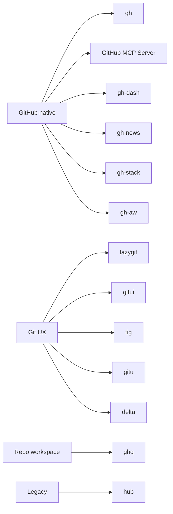

# GitHub CLI と Git TUI の市場地図（2026-06 調査メモ）

確認日: 2026-06-05

## 目的と範囲

このメモは、GitHub CLI、`gh` 拡張、Git TUI、diff / repo 補助ツール、agentic workflow 系ツールを、`awesome-github-tools` のカタログにどう反映するかを整理する公開用の調査メモです。

`README.md` は `catalog/tools.yml` から生成される短いカタログのままにし、背景説明や採用判断の考え方はこの文書に分けます。

対象にするもの:

- GitHub 操作を直接助ける CLI / MCP / `gh` 拡張
- Git の日常作業を軽くする TUI / pager / repo 管理ツール
- AI agent や人間のレビュー、triage、CI/CD 運用に関係する周辺ツール

対象外にするもの:

- GitHub / Git の運用体験と直接関係しない CLI
- 公開ソースやドキュメントで確認できないツール
- 未確認の星数、インストール数、リリース日だけを根拠にした順位付け

## 要約

2026-06 時点の実務的な中心は、GitHub 操作では [GitHub CLI](https://github.com/cli/cli)、ローカル Git 操作では [lazygit](https://github.com/jesseduffield/lazygit)、diff 可読性では [delta](https://github.com/dandavison/delta) です。

`gh` は issue、pull request、Actions、release、GraphQL / REST API、拡張機能を扱う GitHub 側の制御プレーンです。`lazygit` や `gitui` はローカル Git 操作の UI を改善し、`delta` は既存の Git workflow を変えずに review の読みやすさを上げます。

`gh-dash`、`gh-news`、`gh-stack`、`gh-aw` のような `gh` 拡張は便利ですが、第三者拡張や preview / agentic workflow には権限、publisher trust、運用コストの確認が必要です。公式・非公式を問わず、広い権限で GitHub や Actions を操作するものは保守性と安全性を先に見るべきです。

## 推奨スタック

最小構成:

```bash
brew install gh lazygit git-delta
```

レビューや triage が多い人:

```bash
brew install gh lazygit git-delta
gh extension install dlvhdr/gh-dash
```

polyrepo や複数ホストの作業が多い人:

```bash
brew install gh lazygit git-delta ghq
```

agentic workflow や stacked PR を評価するチーム:

```bash
gh extension install github/gh-stack
gh extension install github/gh-aw
brew install copilot-cli
```

この構成は採用候補であり、特に `gh-stack`、`gh-aw`、Copilot CLI はリポジトリの権限、課金、実行環境、監査ログ、チームのレビュー運用を確認してから使います。

## 市場地図



## ツール別メモ

### GitHub CLI

[GitHub CLI](https://github.com/cli/cli) は GitHub 操作の基礎装備です。issue、pull request、Actions、release、`gh api` による REST / GraphQL 操作を一つの CLI にまとめます。

カタログ反映: `recommended` のまま維持し、`gh skill` は個別ツールではなく `gh` の機能方向として notes に書きます。

### GitHub MCP Server

[GitHub MCP Server](https://github.com/github/github-mcp-server) は agent が GitHub repository、issue、pull request、workflow などにアクセスするための公式 MCP です。

カタログ反映: `recommended` のまま維持します。広い GitHub 権限を扱うので risk は `high` のままにします。

### gh-dash

[gh-dash](https://github.com/dlvhdr/gh-dash) は pull request や issue の triage を terminal で行うための `gh` 拡張です。

カタログ反映: `situational` のまま維持し、第三者拡張の trust と Nerd Font / UI 前提を notes に追加します。

### gh-news

[gh-news](https://github.com/chmouel/gh-news) は GitHub notifications を terminal で読むための `gh` 拡張です。[docs.rs の README](https://docs.rs/crate/gh-news/latest) では filtering、preview、auto-refresh、mute、snooze、named views などが説明されています。

カタログ反映: 新規追加します。まだ小さく新しい通知特化ツールなので `watch` にします。

### gh-stack

[gh-stack](https://github.com/github/gh-stack) は stacked PR workflow のための GitHub 公式 `gh` 拡張です。

カタログ反映: `watch` のまま維持し、preview 性と stacked PR を使うチーム向けであることを notes に書きます。

### GitHub Agentic Workflows

[GitHub Agentic Workflows](https://github.com/github/gh-aw) は agentic workflow を GitHub Actions 上で動かすための GitHub 公式 `gh` 拡張です。

カタログ反映: `watch` のまま維持します。便利さよりも、権限、課金、guardrails、workflow safety の確認を優先します。

### GitHub Copilot CLI

[GitHub Copilot CLI](https://github.com/github/copilot-cli) は terminal-native な GitHub Copilot agent runtime です。

カタログ反映: `situational` のまま維持し、install を `brew install copilot-cli` に更新します。古い `gh-copilot` 系 workflow とは分けて扱います。

### lazygit

[lazygit](https://github.com/jesseduffield/lazygit) はローカル Git 操作の第一候補になる TUI です。stage、commit、branch、stash、rebase、conflict まわりを terminal 内で扱いやすくします。

カタログ反映: 新規追加し、`recommended` にします。GitHub API ツールではないため、PR / issue 操作は `gh` や `gh-dash` と組み合わせます。

### gitui

[gitui](https://github.com/gitui-org/gitui) は Rust 製の軽量 Git TUI です。

カタログ反映: 新規追加し、`situational` にします。`lazygit` の代替として扱い、デフォルト推奨にはしません。

### tig

[tig](https://github.com/jonas/tig) は成熟した text-mode Git interface です。SSH や最小環境で Git history や diff を確認する用途に向いています。

カタログ反映: 新規追加し、`situational` にします。新規ユーザー向けの最初の TUI というより、軽量 fallback として扱います。

### gitu

[gitu](https://github.com/altsem/gitu) は Magit に影響を受けた Git TUI です。

カタログ反映: 新規追加し、`watch` にします。方向性は面白いですが、カタログ上の標準推奨にはまだ置きません。

### delta

[delta](https://github.com/dandavison/delta) は Git diff / grep / blame などの pager 体験を改善するツールです。

カタログ反映: 新規追加し、`recommended` にします。既存 workflow を大きく変えずに読みやすさを上げられるため、費用対効果が高い補助ツールです。

### ghq

[ghq](https://github.com/x-motemen/ghq) は clone 済み repository の置き場所を標準化する repo manager です。

カタログ反映: 新規追加し、`situational` にします。polyrepo や multi-host 環境では便利ですが、GitHub API ツールではありません。

### hub

[hub](https://github.com/mislav/hub) は GitHub 操作を `git` の延長で扱う legacy CLI です。

カタログ反映: 新規追加し、`avoid` にします。新規採用ではなく、`gh` へ移行する理由を説明するための entry として扱います。

## カタログ反映方針

- `catalog/tools.yml` は短い判断表にする。
- `README.md` は生成物として維持し、直接編集しない。
- 背景、比較、採用理由、未確認事項は `docs/` に置く。
- exact metrics は変動が早いため、カタログ entry では基本的に使わない。
- `recommended` は default として勧められるものだけに使う。
- `watch` は preview、小規模、新興、広い権限、運用が重いものに使う。
- `avoid` は過去資産の説明や移行理由を残す場合だけ使う。

## 検証と更新ルール

新しい tool entry を入れる前に、次を確認します。

- 公開 source または公式 docs URL がある。
- repo が archived ではない、または archived ならその理由を notes に書く。
- install command が公開 docs、GitHub README、Homebrew、npm、crates.io などで確認できる。
- GitHub token、browser profile、CI/CD、Actions、filesystem write などを扱う場合は risk を保守的に付ける。
- `gh` extension は便利でも、GitHub による署名・保証済みとは限らない前提で notes を書く。
- release date、stars、install counts などの変動値を入れる場合は確認日を併記する。

実装後は次を通します。

```bash
python scripts/validate_catalog.py
python scripts/render_readme.py --check
python scripts/check_links.py
python scripts/check_links.py --live
```

## 今後の公開 Issue 候補

- 追加候補 tool の evidence URL を定期確認する。
- `lazygit`、`gitui`、`delta`、`tig`、`gitu`、`ghq`、`hub` の分類を再確認する。
- `gh` 拡張の trust / permission note を見直す。
- issue template と PR checklist を追加する。
- link check と archived repo check の軽量 automation を検討する。
- README の Quick Picks が増えすぎた場合、表示ルールを見直す。
